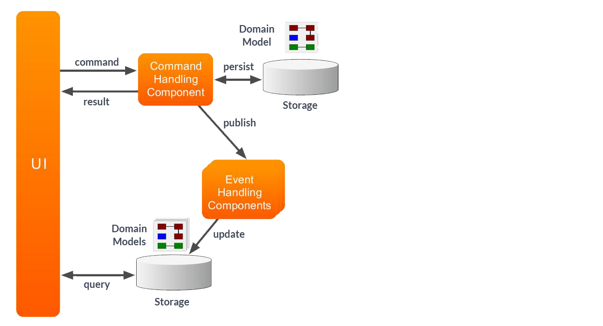
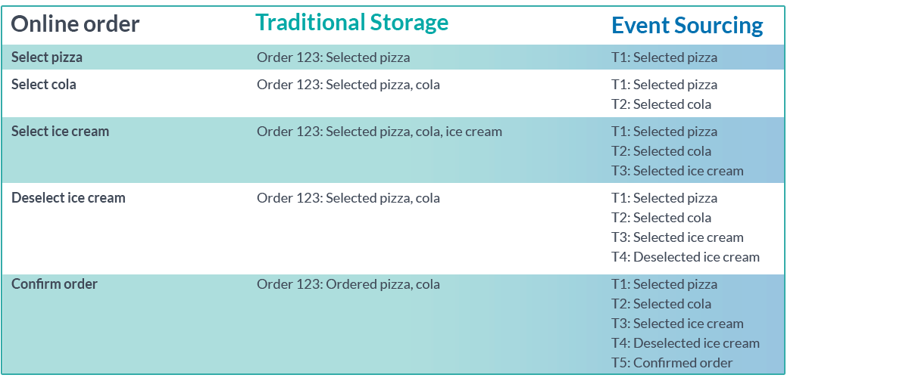

#Spring Boot Event Driven Microservices

---
Technologies used : Java, Spring Boot, Axon Server, H2 Database
Description : Event driven microservices using Spring Boot.

---

<h3>CQRS</h3>

The Command-Query Responsibility Segregation (CQRS) is an architectural pattern where the main focus is to separate the way of reading and writing data. This pattern uses two separate models:
- Commands — responsible for update data.
- Queries — responsible for reading data.

Command Model : 
- The Command Model handles the expressions of intent which an application might have. 
- Such an expression of intent, the command, in general, is a business operation that ideally maps to specific tasks that can be performed. 
- Upon receiving the command, the model will decide whether that task can be executed at that point in time. 
- The decisions making process when handling the command is driven by business logic within the domain the application resides in. 
- These commands can be simple state changes within the application or potentially trigger a multitude of side effects. 
- To decide on this outcome, the Command Model will require some state. 
- The state should by no means encompass all the data flowing through the application. 
- The only information which is necessary for the Command Model is the information that is required to make the decisions.
- This focus on dealing with commands keeps the model concise.

Query Model :
- The Query Model will not deal with any expressions of intent to adjust state or perform some operation. 
- Its sole purpose is to deal with requests for information. 
- The requests for information, the queries, an application should be able to handle can come in very different formats.
- The query side of an application thus needs to support different approaches to retrieving the application's state. 
- Due to the decoupling of the command and query side with CQRS, we can use any storage format for the Query Model without influencing the Command Model’s approach to storing its state to make decisions.
- The separation allows optimizing the query for the exact use case to be as performant, flexible or storage efficient as possible. 
- It will introduce data duplication and where needed data de-normalization. This is however wanted, as your model will focus on what it should return, making the overall application more concise and reliable.

Synchronization of Command and Query :
- As the Command Model is in charge of handling the commands which incur states changes, it will notify the application that such a decision has been made. 
- To achieve this, we can use events as notifiers for the synchronization.

When leveraging this Event Driven Architecture, the Command Model would thus publish an event upon (successfully) handling a command. 
The event will then be handled by the Query Model(s) to update it’s state accordingly. 
Following this pattern for synchronization also allows us to update the Command Model based on the events it publishes itself (Event Sourcing).

---

<h3>Event Sourcing</h3>

Storage : The Event Store is responsible for storing events. 

Event Replaying : In order to have materialized state reconstructed we need to trigger an event replay. 

--- 

<h3>How event sourcing might be helpful</h3>

- In order to comply with certain regulations, it is required from a software system to provide a full audit log. Event-sourced systems give us a full audit log.
- It can be difficult it is to investigate an incident that happened in production. Event sourcing gives us a way to replay events to a certain point in time and debug the application in a state in which the incident occurred.

---

Axon Server

1. Get it from https://axoniq.io/download
2. To run it :
- Either :
  - Unzip it to the location of your choice.
  - Navigate to the location & run it using the command `java -jar axonserver.jar`
- Or :
  - Run it on Docker `docker run -d --name axonserver -p 8024:8024 -p 8124:8124 axoniq/axonserver`
3. Go to 'localhost:8024' to see Axon Server running.

---

H2 Console

Go to : http://localhost:8081/h2-console/